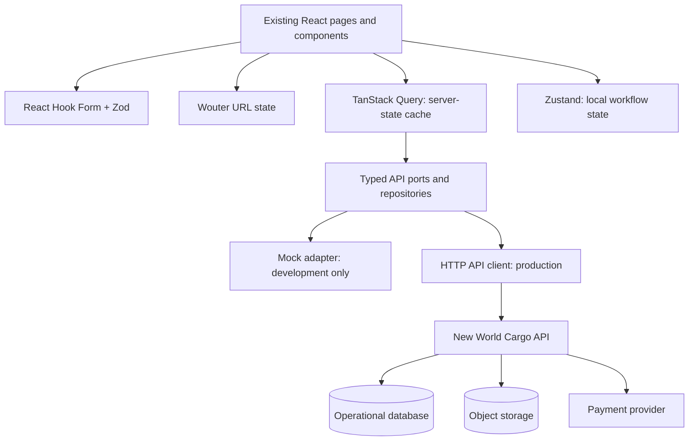

# API-Readiness Implementation Plan

**Project:** New World Cargo customer application  
**Author:** Manus AI  
**Status:** Planning baseline — no production API integration has been added  
**Purpose:** Prepare the existing React customer application so that introducing live APIs replaces the current mock adapter rather than requiring a UI rewrite.

## 1. Decision Summary

The customer application should use **TanStack Query** as the single owner of data read from, and written to, the New World Cargo API. **Zustand** should be limited to small, typed, client-owned workflow state such as an in-progress shipment draft, dismissed local UI state, and non-sensitive preferences. The browser must not persist session credentials, authoritative shipment data, invoices, payment status, or support cases.

> **State ownership rule:** If the server is the authority, TanStack Query owns the client cache. If the browser is the authority until a user submits or discards it, a small Zustand store may own it. If the URL must be shareable or back-button aware, the router owns it.

This division follows TanStack Query’s distinction between asynchronous server state and client state, including query-key based caching and mutation invalidation.[1] Zustand’s official guidance supports typed, selector-based stores and warns that browser persistence requires validation, versioning, and selective persistence.[2] [3]

| Layer | Chosen responsibility | Must not own |
|---|---|---|
| **Wouter/router** | Route, selected tab, public tracking number, filter/search parameters, return path | Domain records or draft payloads |
| **TanStack Query** | API resources, mutations, invalidation, refetching, loading/error states | Form keystrokes or payment credentials |
| **Zustand** | Local shipment composition draft, ephemeral UI preferences, client-only wizard progress | Authoritative shipments, invoices, addresses, notifications, session tokens |
| **React Hook Form + Zod** | One screen’s inputs, field errors, conversion to a request payload | Cross-page data cache or business records |
| **API** | Authorization, validation, pricing, state transitions, records, audit trail | Presentation-only state |

## 2. Current Baseline and Migration Objective

The current application is a polished frontend prototype. It has route-level protected access, a central `AuthContext`, canonical mock domain records, browser mock persistence, shared async-state components, and focused regression tests. The current routes cover shipments, drafts, tracking, quotes, invoices, payments, settings, profile data, support, returns, pickup, proof of delivery, and notifications.[4] [5] [6]

The earlier infrastructure audit found that these workflows are not yet backed by a production domain API or durable operations layer. The goal of this plan is therefore **not** to introduce a second set of screens. The goal is to place stable ports beneath the existing screens, switch one resource at a time from a mock adapter to a live adapter, and keep customer behavior stable throughout.

The production target is a versioned HTTPS JSON API at `/api/v1`. REST is the recommended external boundary because it can be specified in OpenAPI, used by a future mobile client, and independently tested. A server implementation may use any internal framework or RPC style, but it must expose the stable public contract described here.



## 3. Target Frontend Architecture

### 3.1 Directory and dependency boundary

The current `client/src/lib/mock-data.ts` and `client/src/lib/mock-repository.ts` are valuable prototypes, but pages must stop importing them directly. The following structure gives the UI a stable interface while allowing mock and HTTP implementations to coexist during rollout.

```text
client/src/
  api/
    http.ts                    # fetch wrapper, request ID, JSON/error parsing
    contracts/                 # Zod schemas and inferred API DTO types
    ports/                     # resource interfaces used by queries/mutations
    adapters/
      mock/                    # development-only implementation over current mocks
      http/                    # implementation over /api/v1
    query-keys.ts              # one canonical query-key factory
    query-client.ts            # defaults, retry rules, error classification
  features/
    shipments/
      api.ts                   # query/mutation hooks only
      mappers.ts               # DTO-to-view-model conversion
      schemas.ts               # form inputs and request payload conversion
    invoices/
    tracking/
    profile/
    ...
  stores/
    shipment-draft-store.ts    # client-owned, versioned, persisted local draft
    ui-preferences-store.ts    # optional non-sensitive preferences only
  contexts/
    AuthContext.tsx            # replaced by session hooks during migration
```

The recommended packages are `@tanstack/react-query`, `zustand`, and `zod`. React Hook Form already has an appropriate role for individual forms; it should remain form-local. No new global state framework, local-storage cache of API responses, or client-held access token should be introduced.

### 3.2 Typed HTTP client and response contract

Every HTTP call must pass through exactly one client. It must add `Accept: application/json`, conditionally add a CSRF header for cookie-authenticated unsafe requests, propagate a generated client request ID, parse structured errors, and validate all success payloads with Zod before passing them to a component.

```ts
export type ApiSuccess<T> = {
  data: T;
  meta?: { nextCursor?: string; total?: number };
  requestId: string;
};

export type ApiProblem = {
  error: {
    code: string;
    message: string;
    fieldErrors?: Record<string, string[]>;
    retryable?: boolean;
  };
  requestId: string;
};
```

The API should use RFC 9457-style problem information or an equivalent stable envelope. The UI must map `fieldErrors` into forms, map `401` to session recovery, map `403` to a permission message, map `404` to the existing not-found state, map `409` to a conflict-resolution state, and map network/5xx errors to the shared `ErrorState`. Customer-facing errors must never expose provider payloads, database messages, or stack traces.

### 3.3 Authentication boundary

The API should use secure, `HttpOnly`, `Secure`, `SameSite` cookies for the customer session. `AuthContext` is currently a mocked session controller; it should migrate to `useSessionQuery()` and `useLogoutMutation()` with a thin provider only if one is still useful for routing. React components must not read, write, or persist bearer tokens.

Session endpoints should be:

| Endpoint | Purpose | Cache / mutation behavior |
|---|---|---|
| `GET /api/v1/session` | Current authenticated customer, permissions, verified contact state | Query key `session.current`; short stale time; no persistence |
| `POST /api/v1/auth/register` | Create account and begin verification | Invalidate `session.current` after completion |
| `POST /api/v1/auth/login` | Start authenticated session | Invalidate `session.current` on success |
| `POST /api/v1/auth/logout` | End session | Cancel queries, clear QueryClient, reset Zustand stores |
| `POST /api/v1/auth/verify` | Verify OTP / contact challenge | Invalidate `session.current` |
| `POST /api/v1/auth/password/*` | Request/reset/change password | Never cache inputs or secrets |

The server must enforce authorization on every resource query and mutation. Client route protection improves the experience but is not an authorization boundary.

## 4. Server-State Strategy with TanStack Query

TanStack Query’s query keys should encode each resource and the exact filter set used to fetch it. Mutations should invalidate the narrowest affected keys, and optimistic updates should be used only where server transitions are simple and reversible.[1]

```ts
export const queryKeys = {
  session: () => ["session"] as const,
  shipments: {
    all: () => ["shipments"] as const,
    list: (filters: ShipmentListFilters) => ["shipments", "list", filters] as const,
    detail: (shipmentId: string) => ["shipments", "detail", shipmentId] as const,
    tracking: (trackingNumber: string) => ["tracking", trackingNumber] as const,
    drafts: () => ["shipments", "drafts"] as const,
  },
  invoices: {
    list: (filters: InvoiceFilters) => ["invoices", "list", filters] as const,
    detail: (invoiceId: string) => ["invoices", "detail", invoiceId] as const,
  },
  profile: {
    addresses: () => ["profile", "addresses"] as const,
    recipients: (query = "") => ["profile", "recipients", query] as const,
  },
};
```

### 4.1 Query defaults and refetch policy

The application should use conservative defaults, then set explicit resource policies rather than relying on global assumptions.

| Resource | Suggested stale time | Refetch behavior | Notes |
|---|---:|---|---|
| Session | 60 seconds | On window focus | Clear on logout and auth failure |
| Shipment list/detail | 60 seconds | On focus; manual refresh | Invalidate after shipment, pickup, delivery, or return mutation |
| Public tracking | 30 seconds | On focus while page is open | Do not poll by default; add a server event channel later only when required |
| Notifications | 30 seconds | On focus | Invalidate after mark-read actions |
| Invoices | 120 seconds | On focus | Invalidate after confirmed payment webhooks are reflected |
| Addresses / recipients | 5 minutes | On focus | Invalidate after create, edit, delete, or default change |
| Legal copy / office locations | 24 hours | Manual deployment invalidation | Public, rarely changing reference data |

Retry at most once for safe, idempotent `GET` failures and only when the error is retryable. Do **not** automatically retry payment creation, payment confirmation, shipment submission, deletion, cancellation, or address mutations. Those calls require explicit idempotency and an explicit user-visible recovery state.

### 4.2 Mutation rules

Every mutation must have a defined success, invalidation, failure, and rollback rule before it is implemented.

| Mutation | Optimistic update | Required invalidation | Special safeguard |
|---|---|---|---|
| Mark notification read | Yes, reversible | Notification lists and unread count | Roll back on error |
| Set default address | Yes, reversible | Address list | Server enforces one default per customer |
| Save recipient | Optional | Recipient search/list | Validate phone and customer ownership server-side |
| Save shipment draft | No server optimism in first release | Draft list and draft detail | Preserve local draft if request fails |
| Submit shipment | No | Shipment list, detail, drafts, invoices | `Idempotency-Key`; clear draft only after confirmed success |
| Cancel shipment / reschedule | No | Shipment detail/list, tracking | Server returns allowed transition or `409` |
| Start payment | No | Invoice detail/list after confirmed webhook state | No automatic retry; never cache card data |

## 5. Client-Owned State with Zustand

Zustand should be deliberately small. Its persistence middleware defaults to JSON serialization and does not validate stored values, so persisted state must be schema-validated and versioned.[2] Stores should use typed selectors; when a component needs several fields, it should use shallow selection to avoid unnecessary re-renders.[3]

| Store | Allowed state | Persistence | Reset condition |
|---|---|---|---|
| `useShipmentDraftStore` | Current unsent wizard fields, selected origin/destination, cargo rows, local attachment references, current step | Yes, selectively; schema-validated; versioned | Successful submission, explicit discard, logout, expired draft |
| `useUiPreferencesStore` | Non-sensitive display preferences such as a dismissed local education prompt | Optional, selectively | Logout or preference reset |
| `useUploadDraftStore` | Transient upload progress and local `File` references | No | Page refresh, upload completion, cancellation |
| `usePaymentUiStore` | Open invoice ID and current modal step only | No | Modal close, payment result, route change |

The stores must **not** contain shipments, invoices, notifications, addresses, recipients, support cases, return status, payment records, authentication state, or API response caches. Those are server-owned records and belong in TanStack Query.

```ts
type ShipmentDraftStore = {
  version: 1;
  draft: ShipmentDraftInput | null;
  setDraft: (patch: Partial<ShipmentDraftInput>) => void;
  resetDraft: () => void;
};

// Persist only the validated, non-sensitive `draft` field.
// Do not persist File objects, signed upload URLs, payment state, or customer identity.
```

The persisted draft schema must be Zod-parsed during hydration. A storage version change must use an explicit `migrate` function; invalid or stale data should be discarded safely. The existing mock repository is a useful source of local draft behavior, but its browser storage access must become an implementation detail of the mock adapter rather than a dependency of pages.[6]

## 6. Canonical API Contracts

The existing UI types are presentation-friendly but need API-ready corrections. For example, shipment ETA and invoice amounts are currently display strings; API contracts should carry ISO 8601 timestamps and integer minor-unit money values, with formatting performed in view mappers.[7]

### 6.1 Domain rules that must be canonical on the server

| Domain | Canonical fields / rules | API authority |
|---|---|---|
| Shipment | UUID, public tracking number, customer ID, origin/destination IDs, transport mode, cargo items, declared document references, status, allowed actions, revision | Server owns status transitions and eligibility |
| Tracking event | Event ID, type, UTC timestamp, actor/source, public-safe detail | Server creates immutable operational history |
| Address | Customer ID, structured location, label, default flag, verification state | Server enforces one default and ownership |
| Recipient | Customer ID, name, phone normalized to E.164, delivery notes | Server validates ownership and phone format |
| Quote | Quote ID, rules version, expiry timestamp, currency, money fields, selected service | Server calculates and validates expiration |
| Invoice | Invoice number, shipment ID, line items in minor units, status, due timestamp, receipt reference | Server is financial source of truth |
| Payment | Payment intent/reference, provider, status, idempotency key, invoice ID | Server only; webhooks determine final state |
| Attachment | ID, content type, byte size, storage key, scan status, owner, target record | Server authorizes and records metadata |
| Support / return | Case or return ID, state, evidence references, server timestamps | Server controls lifecycle transitions |

### 6.2 Endpoint inventory

The initial API should be resource-oriented and versioned. Each request and response should be described in an OpenAPI document before its client hook is written.

| Resource | Minimum endpoints | Existing customer experiences served |
|---|---|---|
| Session and profile | `GET /session`, `PATCH /profile`, password/contact verification operations | Login, profile, security, sign-in activity |
| Addresses and recipients | `GET/POST/PATCH/DELETE /addresses`, `GET/POST/PATCH/DELETE /recipients` | Settings CRUD, Send recipient/address reuse |
| Reference data | `GET /offices`, `GET /services`, `GET /legal-documents` | Send pickup suggestions, transport options, legal pages |
| Quotes | `POST /quotes`, `GET /quotes/:id` | Quote, expiration, prefill to Send |
| Shipments and drafts | `GET/POST /shipments`, `GET/PATCH /shipments/:id`, `POST /shipments/:id/cancel`, `POST /shipments/:id/duplicate`, `GET/POST/PATCH/DELETE /shipment-drafts` | Home, lists, detail, Send, Drafts |
| Pickup and delivery | `POST/PATCH /shipments/:id/pickup`, `POST/PATCH /shipments/:id/delivery` | Schedule/reschedule/cancel pickup, instructions, delivery changes |
| Public tracking and proof | `GET /public/tracking/:trackingNumber`, `GET /shipments/:id/proof-of-delivery` | Public Track, timelines, POD |
| Invoices and payments | `GET /invoices`, `GET /invoices/:id`, `POST /invoices/:id/payment-intents`, `GET /receipts/:id` | Billing, receipt, payment modal |
| Notifications | `GET /notifications`, `POST /notifications/:id/read`, `POST /notifications/read-all`, `PATCH /notification-preferences` | Notification center and preferences |
| Support and returns | `GET/POST /support-cases`, `GET /support-cases/:id`, `GET/POST /returns`, `GET /returns/:id` | Help, issue report, return workflow |
| Uploads | `POST /uploads/initiate`, `POST /uploads/:id/complete`, `DELETE /uploads/:id` | Debit note, cargo evidence, issue attachments, profile photo |

For public tracking, return only customer-safe progress and delivery information. Apply rate limiting, validation, response-size limits, and abuse monitoring because no authenticated customer session is required.

### 6.3 OpenAPI and code-generation policy

The API repository should publish an OpenAPI 3.1 document. CI must fail when the implementation differs from the contract. Generate or compile client DTO types from that contract, then map DTOs to UI view models in feature-specific mappers. Do not expose raw DTOs directly to components; this protects the UI from harmless server-field evolution.

## 7. Workflow-to-State Mapping

The following table is the migration contract for the existing application routes. It provides the implementation order, server resource, cache behavior, and local state boundary.

| UI workflow / route group | API resource and operations | TanStack Query key | Zustand / form ownership | Migration notes |
|---|---|---|---|---|
| Home | Customer summary; recent shipments; outstanding balance | `dashboard.summary`, shipment list, invoice summary | None | Prefer one summary endpoint to prevent request waterfall |
| Shipments and detail | List, detail, actions, timeline | `shipments.list(filters)`, `shipments.detail(id)` | Detail-modal state only | Server returns `allowedActions`; do not recreate state rules in UI |
| Send and drafts | Draft CRUD, quote lookup, shipment submission, attachment upload | `shipments.drafts`, `quotes.detail` | Draft store + form state | Use idempotency key on submit; server recomputes fees |
| Quote | Create/retrieve expiring quote | `quotes.detail(id)` | Form input until submitted | Quote IDs, expiration, price calculations server-controlled |
| Public tracking | Public tracking read | `shipments.tracking(number)` | Tracking number in URL | Rate limit; no private address or payment data |
| Pickup and delivery | Action commands against shipment | shipment detail/tracking | Dialog form state | `409` must show the supplied transition explanation |
| Invoices and payments | Invoice list/detail, payment intent, receipt | invoice list/detail | Payment modal UI only | Provider completion comes from webhook-backed status, never client assertion |
| Notifications | List/read/preferences | notification list/count | Optional tab selection in URL | Optimistic mark-read only |
| Addresses and recipients | CRUD / default address | profile resource keys | Form input only | Refetch after write; normalize phone server-side |
| Account and security | Session/profile/settings/activity | session and profile keys | No persisted credentials | Logout clears all cache and stores |
| Support and returns | Case/return create and detail | case/return list/detail | Attachment form state only | Upload first, submit attachment IDs |
| Proof of delivery | POD record/download authorization | `pod(shipmentId)` | None | Signed download URLs must be short-lived |

## 8. Migration Plan

### Phase A — Contract and operational foundation

Write the OpenAPI contract, domain state-transition rules, error catalogue, idempotency policy, and authorization matrix before adding a live endpoint. Normalize money to integer minor units, timestamps to UTC ISO 8601, phone numbers to E.164, and identifiers to opaque UUIDs. Add database migrations, repository tests, structured logs, correlation IDs, health/readiness endpoints, and a staging environment.

**Acceptance criteria:** The contract has review approval; every write endpoint documents authentication, authorization, validation, response statuses, idempotency requirements, and error codes; a server can return a real health response without customer UI changes.

### Phase B — Frontend data-layer foundation

Install the approved packages, add `QueryClientProvider` in `main.tsx`, create the canonical key factory and typed HTTP client, and add Zod contract validation. Create the API port interfaces and a mock adapter that preserves the current mock behavior. Pages must consume feature hooks, not mock data or browser storage directly.

**Acceptance criteria:** Switching between `mock` and `api` adapters requires configuration only; existing tests remain green against the mock adapter; no page directly imports `mock-data` or `mock-repository`.

### Phase C — Read paths first

Implement authenticated session, customer summary, shipment list/detail, invoice list/detail, addresses, recipients, and public tracking reads. Run both mock and staging adapters in test environments. Preserve existing loading, empty, offline, and error states, but connect them to actual query status and error classification.

**Acceptance criteria:** Each migrated page has a typed query hook, a query-key test, API contract test, loading/empty/error coverage, and an authenticated staging smoke test.

### Phase D — Low-risk mutations

Add profile, address, recipient, notification, and preference mutations. Use narrowly scoped invalidation; only notification reads and default-address selection qualify for conservative optimistic updates.

**Acceptance criteria:** Field errors render beside the correct input, stale cached lists are invalidated, failures recover without silent divergence, and logout resets client cache and stores.

### Phase E — Shipment composition and operations

Migrate draft persistence, quote creation, attachment upload, shipment submission, pickup changes, delivery instructions, duplicate/cancel workflows, returns, and support cases. Preserve unsent drafts locally and use server-side idempotency for all irreversible submissions.

**Acceptance criteria:** Refreshing before submission restores only the permitted local draft; submitting twice with one idempotency key creates at most one shipment; a `409` presents a clear customer recovery path.

### Phase F — Payments, POD, and production hardening

Add payment intents, provider redirects/SDK handoff where required, webhook-confirmed status updates, receipts, and POD signed downloads. Add production metrics, alerts, audit logs, rate limits, backups, retention policy, security tests, and end-to-end monitoring.

**Acceptance criteria:** The browser never receives or stores sensitive payment credentials; payment status is webhook-confirmed; receipt/POD access is authorized; operational dashboards detect failed API and payment flows.

## 9. Rollout Safeguards

The migration must be incremental. The mock adapter remains available for local development and UI regression tests until its corresponding server adapter has contract coverage. A resource-level switch, not a global big-bang flag, should enable live reads and writes. Production release gates should include a staging smoke test, contract compatibility test, error-rate review, rollback procedure, and customer-support briefing.

| Risk | Safeguard |
|---|---|
| UI and API shape drift | OpenAPI source of truth, generated/validated DTOs, contract tests in CI |
| Duplicate shipment or payment submission | `Idempotency-Key`, server idempotency record, disabled submit state, confirmed response before clearing local draft |
| Stale customer data | Canonical query keys, post-mutation invalidation, focused stale times |
| Leaking private data through cache/storage | Do not persist QueryClient; validate and partialize Zustand persisted state; clear cache on logout |
| Client/server business-rule disagreement | Return server-computed `allowedActions`, quote prices, eligibility, and transition reason; UI never becomes final authority |
| Unreliable network | Existing offline UI, explicit retry for safe reads, local draft preservation only; never offline-queue payment or irreversible shipment actions |
| Attachment abuse | Server-side content-type/size policy, malware scanning, short-lived signed URLs, ownership checks |

## 10. Test and Quality Gates

The implementation is API-ready only when each layer has the following coverage.

| Layer | Required verification |
|---|---|
| API contract | OpenAPI validation, schema tests, backward-compatibility checks |
| Server | Authorization, validation, transition, idempotency, repository, webhook, and upload tests |
| Query layer | Query-key, mapper, success/error, invalidation, rollback, and auth-reset tests |
| Zustand stores | Hydration validation, migration, partial persistence, reset-on-logout, and selector tests |
| UI | Form field errors, loading/empty/error/offline states, mobile workflows, accessible status changes |
| End to end | Register/login, shipment draft/submit, public tracking, invoice payment progression, receipt/POD authorization |
| Operations | Health/readiness probes, structured logs with request IDs, alert test, backup-restore drill, rate-limit test |

## 11. Definition of “Ready for Live APIs”

The frontend is ready to consume a newly exposed endpoint when the following conditions are true:

1. A reviewed OpenAPI operation and Zod DTO schema exist for the resource.
2. The resource has a typed port, HTTP adapter, feature mapper, and canonical query keys.
3. The screen contains no direct mock import or direct browser-storage access for that server-owned record.
4. Loading, empty, unauthorized, forbidden, not-found, validation, conflict, offline, and retry behavior are specified.
5. Every mutation defines idempotency, cache invalidation, rollback strategy, and customer-facing success/failure copy.
6. The mock adapter and staging API adapter both satisfy the same port contract.
7. The route has unit, contract, and staging smoke coverage.

## 12. Immediate Next Build Sequence

The first implementation slice should be **session + addresses/recipients + shipment reads**. It establishes secure authentication, a complete CRUD pattern, query/provider conventions, and the app’s most visible customer data without introducing payment risk. The second slice should add shipment drafts and quote reads. Payment and provider integrations should remain last, after idempotency, observability, uploads, and server-side financial records are proven.

This plan intentionally does not start API integration, install dependencies, or alter customer behavior. It is the build contract for the next implementation phase.

## References

[1]: https://tanstack.com/query/latest/docs/framework/react/overview "TanStack Query — React overview"

[2]: https://zustand.docs.pmnd.rs/reference/middlewares/persist "Zustand — persist middleware"

[3]: https://zustand.docs.pmnd.rs/learn/guides/beginner-typescript "Zustand — TypeScript guide"

[4]: ./client/src/App.tsx "Current route composition"

[5]: ./client/src/contexts/AuthContext.tsx "Current mock authentication context"

[6]: ./client/src/lib/mock-repository.ts "Current browser mock repository"

[7]: ./client/src/lib/domain.ts "Current presentation-domain types"
