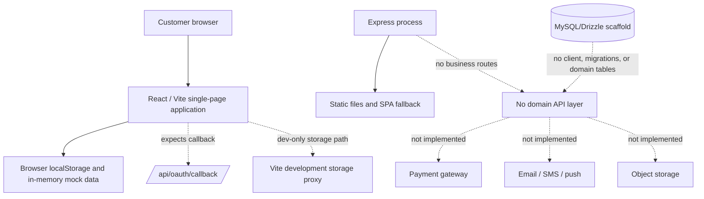

# New World Cargo Infrastructure Completeness Audit

**Audit date:** 16 August 2026  
**Scope:** Application delivery, client runtime, authentication, API/server, domain persistence, database, storage, payments, notifications, security, observability, test automation, and deployment operations.  
**Method:** Source and configuration review, TypeScript validation, regression-test execution, production build validation, dependency-audit review, and recent development-runtime log review.

## Executive assessment

> **Verdict:** The project is a well-developed, static customer-experience prototype, but it is **not yet a production logistics system**. Its current infrastructure is sufficient for demonstrating workflows and collecting UX feedback; it is not sufficient to handle real customer accounts, shipments, payments, documents, delivery status, or support cases.

The frontend is the most mature layer. It has a cohesive React interface, protected-route presentation, offline and error-state components, a successful static build, and 29 focused regression tests. However, the layers beneath it are predominantly placeholders: authentication is stored in the browser, business records are mocked or browser-local, the server is only a static-file host, and the database is a one-table scaffold with no migrations. The current application should therefore be treated as **pre-production frontend staging** rather than a live customer portal.

| Readiness dimension | Current maturity | Production interpretation |
|---|---:|---|
| Customer interface and responsive UX | Strong | Suitable for usability testing and design sign-off. |
| Static delivery and build | Functional | A production static SPA can be served, but it has no business API behind it. |
| Authentication and authorization | Prototype | Mock client state is not safe for real users or permissions. |
| Domain API and persistence | Absent | No live shipment, invoice, payment, tracking, support, or settings records exist. |
| Payments, documents, and notifications | UI-only | No gateway, webhook, storage, messaging, or reconciliation implementation exists. |
| Security, observability, and operations | Incomplete | Production controls and operational evidence are not yet established. |

## Audit boundaries and evidence

This is a source-level infrastructure audit. It verifies what is implemented in the repository and development environment; it does not certify external managed-platform controls such as TLS termination, network segmentation, managed-database backups, or a production WAF, because those controls are not represented in the source tree.

The validation commands completed successfully: `pnpm check`, `pnpm test`, and `pnpm build`. The project has **12 test files and 29 passing tests**. The production build emits a static client bundle and a minimal server bundle, with the client JavaScript chunk measured at approximately **1.09 MB before gzip**. The build itself warns that the application should be code-split. The production dependency audit returns a non-zero status and reports **16 high**, **47 moderate**, and **8 low** advisory records in the current production dependency tree.

## End-to-end architecture: current state

The most important architectural break is between the React interface and a real business API. The user sees complete workflows, but those workflows do not yet invoke authenticated server operations or durable domain records.

## Layer-by-layer findings

### 1. Delivery, runtime, and deployment layer

The build is functional and produces `dist/public` for the browser plus a small Node/Express output. The configured project template is still `web-static`; there is no deployment manifest, container definition, infrastructure-as-code, environment template, or repository CI workflow. The Express runtime serves static files and returns the SPA entry document for every unmatched path. It does not expose a health endpoint, version endpoint, readiness check, API router, request identifiers, graceful shutdown handling, or structured production logging.[1] [2]

The SPA fallback is especially important: an unimplemented request such as `/api/oauth/callback` will be caught by the catch-all route and receive the frontend document rather than an authentication response. This means the client-side OAuth helper and the deployed server do not currently form a valid authentication boundary.[3] [4]

| Delivery control | Current state | Gap or action |
|---|---|---|
| Production build | Passing | Maintain as a required merge gate. |
| Static asset serving | Implemented | Keep, but place domain APIs before the SPA fallback. |
| Health and readiness endpoint | Missing | Add `/healthz` and `/readyz` with dependency checks. |
| CI workflow | Missing | Add GitHub Actions for typecheck, tests, build, dependency audit, and migration checks. |
| Deployment specification | Missing | Document the runtime contract; add a deployment manifest or container only if the hosting target requires one. |
| Client bundle performance | Warning present | Split route-level pages and defer non-critical visual libraries. |

### 2. Client application and edge behavior

The client is substantial: it contains the completed customer routes, reusable state components, form flows, route-level error presentation, and an application error boundary. This is valuable product work and should be preserved as the presentation layer. However, the data boundary remains mock-based. The centralized mock repository explicitly uses `localStorage` in the browser and an in-memory map only as a non-browser fallback; it is not a server data service.[5]

Browser-local state is also used directly in several workflow modules, including authentication, payments, drafts, quotes, recipients, shipment detail, and theme settings. As a result, records do not synchronize across devices, cannot be centrally audited, and can be altered by the user’s browser. The existing loading, empty, error, and offline states are useful UX states, but they are currently simulated through route parameters rather than the state of real requests.[5] [6]

### 3. Identity, sessions, and authorization

The current authentication context is intentionally mocked. Login decisions are determined in the browser, a user profile is written into `localStorage`, password verification compares against a literal client-side test value, verification codes are frontend constants, and account deletion only clears local browser state.[7] This must not be exposed as real authentication.

There is also a legacy OAuth bootstrap helper that constructs a browser redirect to an expected callback at `/api/oauth/callback`; the current server has no route for it. The helper serializes the redirect URI in base64 state rather than binding a server-side session or a validated nonce. Until a real server-side OAuth/session implementation is added, this path should remain disabled or be explicitly marked as mock-only.[3] [4] [7]

| Identity requirement | Current state | Production requirement |
|---|---|---|
| User registration and login | Mocked in browser | Server-side credential or OAuth flow with verified users. |
| Session storage | `localStorage` profile object | Secure, HttpOnly, SameSite session cookie or managed identity token flow. |
| Password reset and change | Mock responses | Hashed credentials, reset tokens, expiry, delivery channel, audit events, and rate limits. |
| Authorization | Route display only | Server-enforced ownership and role checks on every protected operation. |
| Login security | No throttling or event log | Rate limiting, lockout policy, IP/device telemetry, and sign-in audit trail. |

### 4. API and domain-service layer

There is no implemented business API. The only server source file starts an Express process for static-file delivery; it has no JSON parsing, authenticated endpoints, request validation, service layer, error contract, domain repository, or API versioning.[1] The customer flows therefore have no implementation for creating a shipment, uploading a debit note, quoting a route, paying an invoice, changing an address, opening a support case, or consuming carrier tracking events.

The missing API layer is the principal production blocker. The recommended pattern is to introduce a typed server contract—either tRPC or a versioned REST API—and separate its concerns into route/procedure, validation, service, repository, and integration modules. Every request that changes customer data should validate input with shared Zod schemas, enforce the authenticated user and resource ownership on the server, and return stable error codes for the client.

### 5. Database, migrations, and domain model

The repository includes a Drizzle schema, but it defines only a generic `users` table and explicitly leaves the rest of the model as a TODO. The migration journal has no entries and the migrations directory contains only a placeholder. There are no declared relationships and no database access module in the server path.[8] [9]

The current database layer cannot persist the product’s core concepts. Before connecting the frontend, define the minimum durable model: customer profile and verification records; saved addresses and recipients; shipment requests and cargo items; transport legs and milestone events; quotes; invoices, invoice lines, payments, refunds, and payment attempts; documents; notifications and preferences; support cases; returns; delivery instructions; and immutable audit events.

| Domain area shown in UI | Database/API readiness | Minimum missing backend capability |
|---|---|---|
| Customer account and saved details | None | Ownership-scoped profile, address, recipient, and preference tables. |
| Shipments and tracking | None | Shipment aggregate, cargo items, tracking events, status state machine, and public tracking projection. |
| Quotes and invoices | None | Quote expiry, invoice/line items, currency handling, and immutable invoice snapshots. |
| Payments and refunds | None | Provider transaction records, webhook receipts, idempotency, reconciliation, and refund lifecycle. |
| Documents and proof of delivery | None | Object storage references, content metadata, access controls, and retention policy. |
| Support, returns, and notifications | None | Case, return, notification, preference, and event-outbox tables. |

### 6. Files, storage, payments, and external integrations

The user interface accepts business documents and uses payment dialogs, but no production integration supports either operation. The Vite configuration includes development-time storage proxy behavior, not a deployed server storage service.[2] The product needs a server-side file-upload contract that stores file bytes in object storage and writes only metadata and access-control references to the database. Signed upload and download URLs must be scoped to the authenticated owner and content type/size validated.

Payment methods currently represent UI states only. Before enabling live payment, implement a provider adapter, create payment-intent records on the server, verify provider webhooks, make webhook handlers idempotent, reconcile invoice state from trusted provider events, and prevent client-originated invoice-status changes. The same pattern applies to SMS/email/push notifications and carrier status ingestion: each requires a server integration, retry policy, observability, and an event/audit record.

### 7. Security and supply chain

The source currently has no server-side hardening middleware or route-level controls because it has no business API. The production server does not declare security headers, request size limits, CORS policy, rate limiting, CSRF/session protection, API authentication middleware, input validation, or centralized error sanitization.[1] These controls should be introduced before any customer data is accepted.

The current production dependency audit must be remediated before a public launch. It reports 16 high-severity advisory records, including advisories in the Axios dependency path, along with moderate and low findings in transitive packages. The audit provides direct update actions for several modules, while some packages require review or a parent-package upgrade. The package manager also warns that `pnpm` configuration fields inside `package.json` are no longer read, so overrides and patch behavior must be migrated to the current pnpm configuration mechanism.[10] [11]

No secret values are reproduced in this report. Local project metadata is not tracked by Git according to the audit check. Even so, production secrets must be managed only through the deployment secret store, rotated if exposure is suspected, and never copied into source files, browser bundles, issue comments, or client-visible variables unless deliberately designed as public keys.

### 8. Observability, reliability, and operations

The development environment captures browser and network logs, and analytics requests are completing successfully in recent development logs. Those facilities are helpful for development, but the repository does not implement production structured logging, error monitoring, traces, alert routing, health probes, backup/restore tests, an audit trail, or service-level objectives.[12]

There are also no background workers, queues, scheduled-task definitions, retry/dead-letter patterns, or event outbox. A logistics application requires asynchronous processing for notification delivery, payment webhook recovery, status ingestion, document processing, quote expiry, and potentially scheduled reminders. These responsibilities should not be implemented in browser timers or an autoscaling request process without a durable job/event design.

## Test and quality assessment

The current test suite is useful but intentionally narrow. All 29 tests are client-side workflow, presentation, or pure-helper tests. There are no server tests, database tests, API contract tests, authenticated integration tests, migration tests, payment-webhook tests, file-access tests, end-to-end browser tests, load tests, or recovery tests. The type check, test suite, and production build pass; this is a healthy frontend baseline, not evidence of backend readiness.[11]

| Quality control | Current evidence | Required next step |
|---|---|---|
| TypeScript | Passing | Preserve as a required CI gate. |
| Unit tests | 29 passing client-focused tests | Add service, repository, and route/procedure tests with real fixtures. |
| Build validation | Passing | Run in CI and publish build artifacts only after checks pass. |
| Browser/end-to-end tests | Missing | Cover sign-in, create shipment, upload, invoice payment, tracking, logout, and error recovery. |
| Database migration tests | Missing | Spin up an isolated database, apply migrations, and validate rollback/upgrade compatibility. |
| Security tests | Missing | Add authorization-negative cases, rate-limit checks, webhook-signature tests, and dependency scanning. |

## Production gates

The following gates should be considered mandatory before accepting real users, money, or logistics documents.

| Gate | Why it blocks production | Owner type |
|---|---|---|
| Replace mock auth and local browser records | Client-controlled identity and data are not trustworthy. | Backend and security |
| Implement the domain API and ownership checks | UI workflows currently have no authoritative execution path. | Backend |
| Design schema and apply migrations | There is no durable model for core business records. | Backend and data |
| Secure file upload and document access | Debit notes and proof-of-delivery assets need controlled storage. | Backend and security |
| Implement payment gateway plus signed webhook processing | Invoice state cannot be trusted from browser actions. | Payments/backend |
| Add operational monitoring, backups, and incident runbooks | Failures cannot be detected, diagnosed, or recovered reliably. | Platform/operations |
| Clear dependency advisories and enforce CI | The production dependency tree has unresolved high-severity findings. | Platform/security |

## Recommended remediation sequence

### Foundation: create a real application boundary

Start by converting the static project into an actual full-stack service without rewriting the finished frontend. Add a typed API boundary, secure session handling, server input validation, standardized error responses, a health endpoint, structured logging, and basic security middleware. Build the database connection, migration workflow, and the foundational customer/account tables first. This phase should also add CI, dependency scanning, and a staging environment with non-production integrations.

### Core product: persist the shipment lifecycle

Next, implement the shipment aggregate and its related records: addresses, recipients, cargo items, shipment status transitions, tracking events, documents, quotes, invoices, and notification preferences. Move the current mock repository interface behind real API calls so the frontend can retain its completed workflows while swapping implementations. Establish authorization rules and immutable audit events at this stage, not after payments begin.

### Integrations: payments, documents, and communications

After core persistence is stable, add object storage for debit notes and proof-of-delivery assets; integrate a payment provider with server-created intents and signed, idempotent webhooks; then add email/SMS/push delivery through a queued outbox. Carrier and warehouse events should enter through authenticated ingestion endpoints or approved partner integrations and drive the customer tracking timeline from durable events.

### Operations: make the system supportable

Finally, add production error reporting, traces, metrics, alerts, dashboards, backup and restore rehearsal, retention policies, privacy/consent controls, runbooks, and load testing for public tracking and payment-webhook spikes. Route-level code splitting should also address the current client bundle-size warning.

## Conclusion

The frontend is a strong foundation, and retaining its existing workflows will accelerate the next build phase. The infrastructure beneath it remains largely unimplemented by design. The immediate priority is not further UI work; it is to establish authoritative identity, a typed API, a durable database model, and secure integration boundaries. Once those foundations exist, the current interface can move from a convincing demo to a dependable customer logistics portal.

## References

[1]: ./server/index.ts "Static server entry point"
[2]: ./vite.config.ts "Vite build and development-time storage configuration"
[3]: ./client/src/const.ts "Client OAuth redirect helper"
[4]: ./client/src/App.tsx "Client route and protected-route composition"
[5]: ./client/src/lib/mock-repository.ts "Browser mock persistence implementation"
[6]: ./client/src/lib/page-state.ts "Client route state helper"
[7]: ./client/src/contexts/AuthContext.tsx "Mock authentication context"
[8]: ./drizzle/schema.ts "Current database schema"
[9]: ./drizzle/meta/_journal.json "Drizzle migration journal"
[10]: ./package.json "Runtime dependencies and build scripts"
[11]: ./client/src/lib "Client regression-test suite"
[12]: ./.manus-logs/ "Development runtime log collection"
